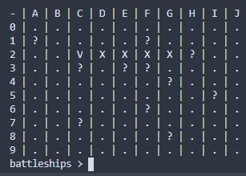
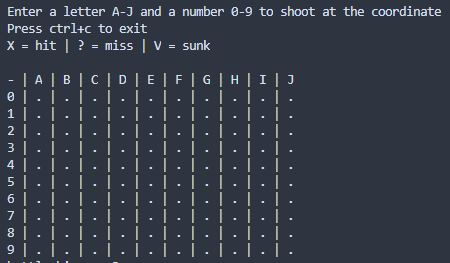

# Guestline battleships exercise




## Setup
```bash
git clone https://github.com/pabrodez/guestline-battleship.git
cd guestline-battleship
npm install
npm build
```
## Start
```bash
npm play
```
## Run tests
```bash
npm test
```